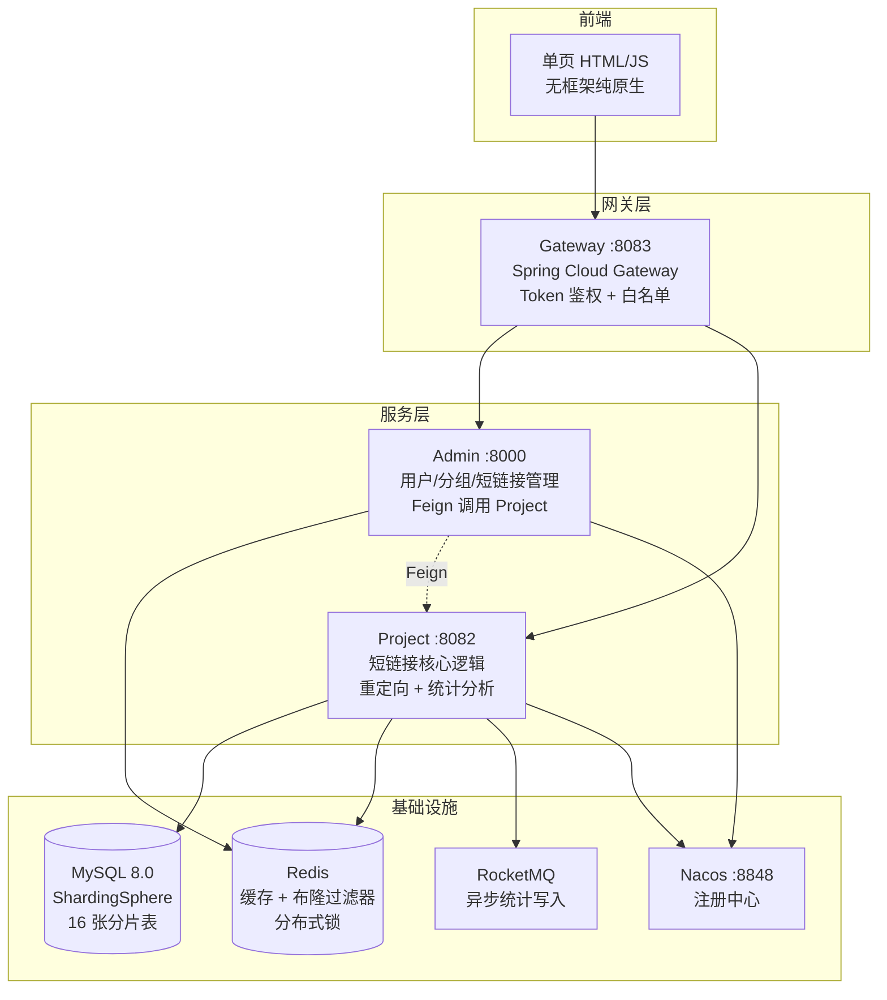
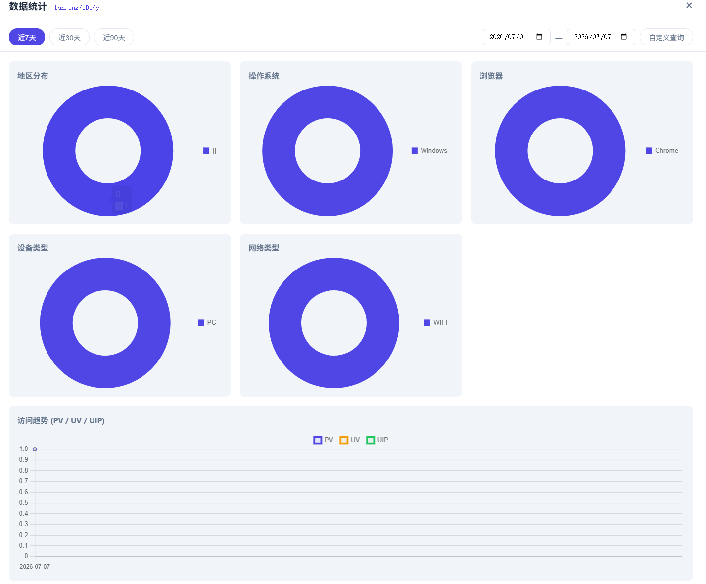
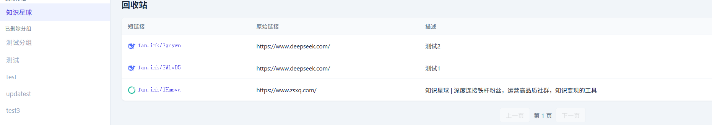

# ShortLink — SaaS 短链接管理系统

基于 Spring Cloud Alibaba 微服务架构的 SaaS 短链接平台，支持短链接生成、管理、统计分析、回收站等功能。

## 架构概览



## 技术栈

| 类别 | 技术                                  | 版本 |
|------|-------------------------------------|------|
| 框架 | Spring Boot + Spring Cloud Gateway  | 3.0.7 / 2022.0.3 |
| 微服务 | Spring Cloud Alibaba（Nacos + Feign） | 2022.0.0.0-RC2 |
| ORM | MyBatis-Plus                        | 3.5.3.1 |
| 分库分表 | ShardingSphere JDBC                 | 5.3.2 |
| 缓存 | Redis + Redisson + Caffeine         | 7.x / 3.21.3 / 3.1.7 |
| 消息队列 | RocketMQ                            | 2.3.0 |
| 工具库 | Hutool + fastjson2 + Guava          | 5.8.20 / 2.0.36 / 30.0 |
| 鉴权 | Redis Token（UUID）                   | — |
| API 文档 | Knife4j（OpenAPI 3.0）                | 4.3.0 |
| 限流 | Sentinel + lua                      | — |
| 数据库 | MySQL                               | 8.0 |
| 前端 | 原生 HTML/CSS/JS（零框架依赖）只做简单的联调使用      | — |

## 模块结构

```
shortlink/
├── admin/                    # 管理服务（BFF 层）
│   └── 用户注册/登录、分组管理、短链接 CRUD、
│       回收站管理、统计数据聚合
├── project/                  # 核心服务
│   └── 短链接生成（MurmurHash + Base62）、
│       重定向跳转、访问日志异步写入、
│       统计查询、回收站内部逻辑
├── gateway/                  # API 网关
│   └── 路由转发、Token 鉴权、白名单校验
├── frontend-practice/        # 前端（单页应用）
│   └── index.html            # 登录/注册/工作台/回收站/统计
└── pom.xml                   # Maven 父 POM
```

## 核心功能

### 短链接管理
- **创建短链接**：输入原始 URL，通过 MurmurHash + Base62 算法生成 6 位短链码，支持有效期设置
- **分组管理**：自定义分组，拖拽排序，支持软删除/物理删除
- **编辑与删除**：修改描述、有效期等信息；软删除链接移入回收站

### 短链接跳转（高并发核心链路）
- 四层缓存穿透防护：**Redis → 布隆过滤器 → 空值缓存 → 分布式锁 + MySQL**
- 返回 307 Temporary Redirect，浏览器不缓存跳转
- 访问日志通过 **RocketMQ 异步写入**，不阻塞跳转响应

### 回收站
- 已删除链接按分组展示，支持**恢复**和**彻底删除**
- 删除分组时：空分组物理删除，非空分组内链接自动移入回收站
- 已删除分组在回收站侧边栏置灰展示

### 访问统计
- 仪表盘：今日/累计 PV/UV/UIP、访问趋势图
- 多维度分析：地区分布、操作系统、浏览器、设备类型、网络类型
- 支持批量查询统计接口

### 用户系统
- 注册（布隆过滤器 + 分布式锁防重名）
- UUID Token 登录（Redis Hash 存储，30 分钟过期），单用户最多 3 个并发会话
- 短链接域名黑名单过滤（淘宝、小红书等）

## 数据库设计亮点

- **分片策略**：`t_link` 表按 `gid` 哈希分为 16 张分片表（`t_link_0` ~ `t_link_15`）
- **唯一索引**：`(full_short_url, del_time)` 联合唯一索引，利用 `delTime="0"` 保证活跃链接唯一性，同时允许回收站中同名链接共存
- **查询索引**：`(user_name, gid, del_flag)` 覆盖常用列表查询
- **统计表**：`t_link_access_stats` 按日期分表（日增），`t_link_*_stats` 按短链接维度聚合

## 快速启动

### 环境要求

- JDK 17+
- MySQL 8.0
- Redis 7.x
- Nacos 2.x
- RocketMQ 5.x
- Maven 3.8+

### 启动步骤

1. **启动基础设施**

```bash
# 一键启动 MySQL、Redis、Nacos、RocketMQ
docker-compose up -d
```

2. **初始化数据库**

将建表 SQL 文件放入 `sql/` 目录，Docker 启动 MySQL 时会自动执行。首次启动后数据库即就绪。

3. **配置本地域名**

短链接域名 `fan.ink` 为自定义域名，本地开发需在 hosts 文件中添加映射：

```
127.0.0.1 fan.ink
```

添加后通过浏览器访问 `http://fan.ink:8082/{短链接码}` 即可测试跳转。如需去除端口号，可自行配置 Nginx 反向代理到 Gateway（8083）。

> 如需更换域名，修改 `project` 模块 `application.yml` 中的 `spring.short-link.domain` 配置项即可。

4. **配置 Nacos**

确保 Nacos 运行在 `127.0.0.1:8848`，各服务启动后会自动注册。

5. **启动服务**

```bash
cd shortlink
mvn clean install -DskipTests

# 按顺序启动：project → admin → gateway
mvn spring-boot:run -pl project
mvn spring-boot:run -pl admin
mvn spring-boot:run -pl gateway
```

6. **访问前端**

打开 `frontend-practice/index.html`，或部署到网关统一访问。

- Knife4j 文档：`http://localhost:8083/doc.html`
- Admin 服务：`http://localhost:8000`
- Project 服务：`http://localhost:8082`

## 注意事项

- **MyBatis-Plus 逻辑删除**：项目中已关闭 MP 的 `logic-delete` 全局配置，所有 `delFlag` 字段均为手动处理。原因：MP 会在查询时自动追加 `del_flag=0`，与回收站按 `del_flag=1` 查询冲突（`WHERE del_flag=0 AND del_flag=1` 恒为空）。维护时切勿重新开启该配置。
- **高德地图 API Key**：地区分布统计依赖高德地图逆地理编码 API，需要在 `project` 模块 `application.yml` 中配置 `locale.gaoDe.apiKey`。项目中的 key 仅用于测试，请到[高德开放平台](https://lbs.amap.com)自行申请。
- **`delTime` 字段约定**：活跃链接 `del_time = "0"`，删除时写入毫秒时间戳，恢复时重置为 `"0"`。这是 `(full_short_url, del_time)` 联合唯一索引能正常工作的前提，因为 MySQL 中多个 `NULL` 不算冲突，但多个 `"0"` 算。
- **短链接跳转端口**：本地开发时短链接域名为 `fan.ink:8082`（带端口），生产部署建议通过 Nginx 反代到 Gateway 统一入口。

## 项目亮点（面试可讲）

1. **微服务拆分**：Admin 作为 BFF 层聚合接口，Project 专注核心逻辑，Gateway 统一鉴权
2. **分库分表**：ShardingSphere 按 `gid` 哈希分 16 表，支持水平扩展
3. **缓存穿透四层防护**：布隆过滤器 + Redis + 空值缓存 + 分布式锁兜底
4. **异步消峰**：访问统计通过 RocketMQ 异步写入，不影响跳转性能
5. **布隆过滤器**：通过布隆过滤器完成判断短链接是否已存在，远远超过分布式锁搭配查询数据库方案。
6. **Redisson读写锁**：使用 Redisson 分布式读写锁功能，完成短链接在大量访问场景的数据修改功能。

## 截图

> 统计图：
> 回收站：
